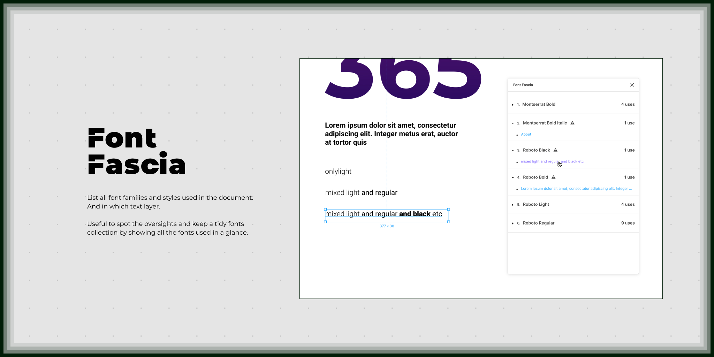

# Font Fascia

Public repo of the Figma plugin [Font Fascia](https://www.figma.com/c/plugin/746097413727734148/Font-Fascia).

List all font families and styles used in the document. And in which text layer.
Useful to spot the oversights and keep a tidy fonts collection by showing all the fonts used in a glance.

Version: 1.2.0

Author: [thenew](http://thenew.fr/)

## Issues

- Get `font-weight` value, not available in Figma API

## Changelog

### 1.2.0 (1 April 2023)

- Update default scope: from `all` to `page`
- Remove confusing "only one use" warning

### 1.1.0 (1 June 2020)

- Add "Search on current page only"
- Add order by font name and number of uses

### 1.0.0 (21 August 2019)

- Initial release